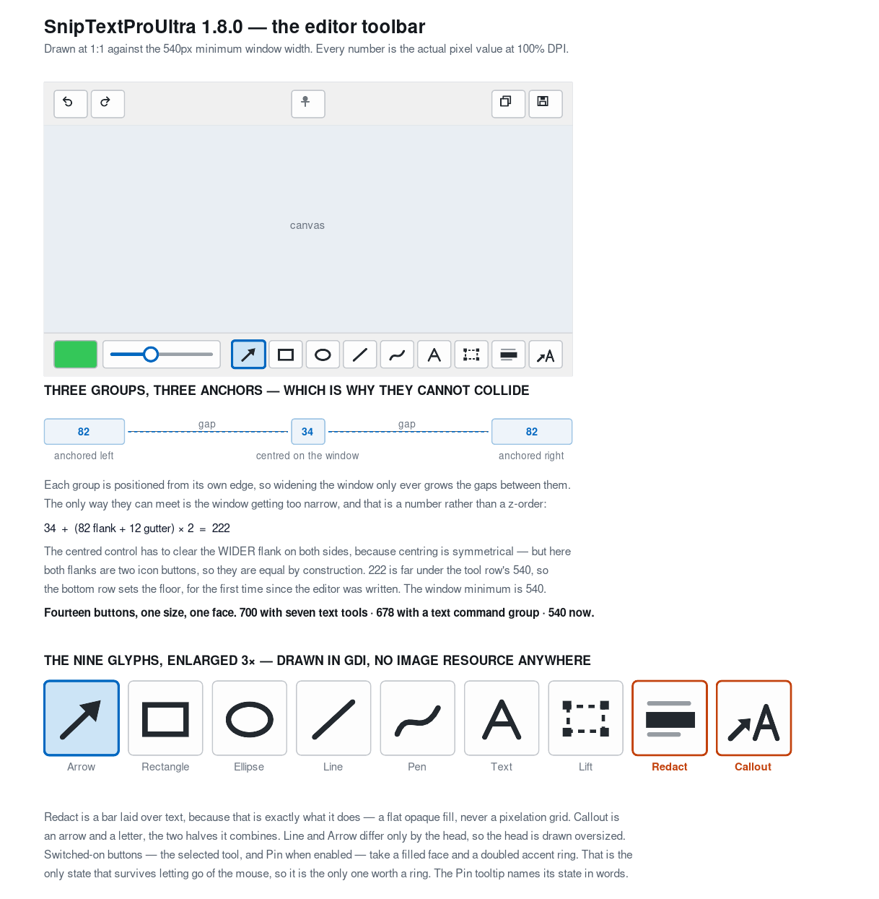

# Architecture

How the Windows port is put together, what changed from the macOS original and why, and the problems that turned out to be harder than they looked.

## Build model

No Visual Studio project file. `build.bat` compiles `src/*.cpp` with `cl.exe`, links statically, and embeds the icon and manifest. `CMakeLists.txt` does the same thing for people who prefer CMake. The whole build takes seconds and depends on nothing outside the Windows SDK.

**No C++/WinRT, deliberately.** The OCR engine is a WinRT type, and the obvious way to reach it is C++/WinRT — which means either a NuGet package or a `cppwinrt.exe` code-generation step in the build. Neither is compatible with "clone it and run `build.bat`". So `Ocr.cpp` uses the ABI headers (`windows.media.ocr.h`) with WRL's `ComPtr`, which ship in the SDK and need no generation. It is more verbose at exactly one call site and costs the project nothing.

## Files

| File | Role |
|---|---|
| `main.cpp` | Entry point: DPI declaration, COM, hand-off to `App` |
| `App.cpp` | The flyout menu, hotkeys, both capture pipelines, recording state |
| `framework.h` | Windows configuration macros and the RAII wrappers |
| `Util.cpp` | Strings, code points, paths, time, DPI, geometry |
| `Hotkeys.cpp` | The six shortcuts: bindings, persistence, and the rebinding window |
| `PinnedWindow.cpp` | A capture stuck to the screen: topmost, draggable, zoomable |
| `Settings.cpp` | Registry-backed settings, and Run-at-Startup |
| `MediaFolder.cpp` | One output folder — three instances |
| `Bitmap.cpp` | 32-bit BGRA DIB section, PNG encoding, clipboard |
| `Capture.cpp` | Screen grabs and the synthesised shutter sound |
| `RegionOverlay.cpp` | The full-desktop selection overlay, in two styles |
| `Ocr.cpp` | `Windows.Media.Ocr` plus reading-order sort |
| `RecordingIndicator.cpp` | The green frame and the Stop pill shown while recording |
| `OcrLine.h` | One visual line: text plus bounding geometry |
| `TextNormalizer.cpp` | Raw OCR lines → pasteable text |
| `Clipboard.cpp` | Text clipboard write with read-back verification |
| `Annotation.cpp` | Shape model, drawing, hit-testing, resize geometry |
| `EditorWindow.cpp` | The editor: canvas, toolbars, selection, text entry, export |
| `EditorSettings.cpp` | Persisted tool, colour, stroke width |
| `VideoSettings.cpp` | Frame rate, quality, cursor/clicks, microphone |
| `ScreenRecorder.cpp` | Media Foundation sink writer and the recording state machine |
| `Toast.cpp` | The brief confirmation above the taskbar |

---

## The app model: what "taskbar icon" had to mean

The macOS original is `LSUIElement`: no Dock icon, no window, a menu bar item that owns a menu. Windows has no menu bar, so there were three candidates.

1. **A notification-area (tray) icon.** Closest in spirit, but you cannot pin it to the taskbar, and Windows 11 hides tray icons behind a chevron by default — so the icon the user asked for would usually be invisible.
2. **A visible window with a taskbar button.** Gets a taskbar button, but only while a window is showing. A utility that must keep a window open to be reachable is not the same utility.
3. **A pinned shortcut that relaunches.** What shipped.

Pinning on Windows pins a shortcut to the executable, so clicking a pinned icon launches the program. The first launch stays resident; every later launch finds the running instance through a named mutex plus `FindWindow`, posts it a registered window message, and exits. The running instance opens its menu.

That gives the user one icon that opens one menu, which is what they asked for, without keeping a window on screen or hiding in a chevron.

### The tray icon, and a reversed decision

The first version put **nothing** in the tray while idle, on the grounds that an idle utility should be invisible and that the pinned taskbar icon was the way in.

That was wrong in practice, for a reason the design missed: with no window and no tray icon, there is no evidence the program is running at all. The only way to check was Task Manager, and the only way to quit was to open the menu from the pinned icon and find *Quit* at the bottom. "Invisible when idle" is a good property for a background service and a bad one for something a person is supposed to trust is listening for their hotkeys.

So there is now one permanent tray icon. Either mouse button opens the same menu — a left-click that did something different from a right-click would be a trap. While recording it alternates with a red square once a second rather than a second icon appearing, so the tray slot never moves.

Idle cost: a message loop, six hotkey registrations, one tray icon, and a zero-size `WS_EX_TOOLWINDOW` window that never appears in the taskbar or in Alt-Tab. No timer, no thread.

---

## DPI: the bug that only appears on someone else's monitor

The process declares **Per-Monitor-V2** awareness in the manifest *and* calls `SetProcessDpiAwarenessContext` before any window exists.

This is not cosmetic. Without it Windows virtualises coordinates: `GetCursorPos`, window rectangles and monitor bounds all come back in scaled logical units that do not match the pixels a `BitBlt` actually produces. A region selected on a 150% display then captures the wrong rectangle — and works perfectly on a 100% monitor, which is what makes it so easy to ship.

This is the direct Windows analogue of the `backingScaleFactor` crop bug the macOS version had to fix, and it has the same tell: correct on the developer's machine, wrong on the user's.

With Per-Monitor-V2 declared, **every coordinate the program handles is a physical pixel on every monitor**, and no scaling conversion appears anywhere in the capture or recording paths. The only place `DpiScaleForWindow` is used is for sizing chrome that should stay a constant physical size.

---

## The region overlay

One window covering the entire virtual desktop, painted with a **frozen screenshot of it**, taken before the window goes up.

Freezing first buys three things at once: the overlay can draw a dimmed backdrop with a bright hole in it, it can never appear in its own capture, and the screen underneath cannot change halfway through a selection. It is also how the Snipping Tool works, for the same reasons.

Two styles share the machinery:

- **Instant** — drag, release, done. Space switches to click-a-whole-window. Used by both Screenshot commands.
- **Adjustable** — a persistent rectangle with eight handles and a Record button; Enter confirms. Used by Screen Record a Region.

### It runs its own message loop

`RegionOverlay::Run` blocks until the user confirms or cancels. The alternative — returning to the app's loop and finishing in a callback — means every caller has to cope with a selection that is half made, which is where the macOS version's trickiest overlay bugs lived. A modal loop makes the caller read as straight-line code.

Two details in that loop:

- It exits on a `finished_` flag, woken by a posted `WM_NULL`. Posting `WM_QUIT` instead would leave a quit message in the thread queue that the app's own loop could later pick up and act on.
- `IsShowing()` stays true from the moment the overlay goes up until the `RegionOverlay` object is destroyed — which deliberately spans the gap between the window being hidden and the caller acting on the result. A second overlay raised inside that gap would end up in the first frames of the recording about to start.

### Only the changed rectangle repaints

`SetSelection` invalidates the **union of the old and new rectangles, grown by 90 pixels** — enough to cover the 2-pixel border, the handles, the size readout above and the controls below.

This view covers every monitor. Repainting a multi-megapixel composite on every mouse-move event is exactly what makes a selection feel sluggish, and mouse-move is when this runs. The paint itself goes through an off-screen buffer the size of the dirty rectangle, then one `BitBlt` to the screen.

The hint bar and the Record button are **not** covered by that 90-pixel padding and are unioned in explicitly. The bar is 560 px wide and centred on the selection, so any selection narrower than 380 px leaves it sticking out past the padded rectangle at both ends; and both the bar and the button flip to the other side of the selection when they run out of room, which moves them an arbitrary distance in one step. Asking the geometry where they are, before and after, is exact for every size and position — two extra calls per mouse-move against arithmetic this cheap costs nothing.

### Painting is synchronised with the compositor

`OnPaint` ends with `DwmFlush`. Without it the border **tears**: a full-desktop opaque window blitting on every mouse-move writes into its surface at the mouse's report rate, DWM copies that surface on its own clock, and a blit landing mid-copy gives a composed frame that is part new selection and part old, split along one scanline. It is visible next to the pointer because that is where the only changing pixels are — everywhere else the two frames are identical.

`DwmFlush` blocks until DWM finishes its next composition, so each blit starts just after one ended and has most of a frame interval to complete in. It is the documented remedy for GDI drawing under the compositor, and the same call `capture::` makes before reading the screen.

It costs nothing in responsiveness and gives some back: painting is capped at the refresh rate rather than the mouse's report rate, and mouse-moves coalesce while it waits, so no pointer positions are lost — only redraws nobody saw.

### Window picking

Space toggles a mode where the window under the pointer is highlighted. Two details:

- The overlay hides itself for the duration of the `WindowFromPoint` call, because it is on top of everything and would otherwise always be the answer.
- Bounds come from `DwmGetWindowAttribute(DWMWA_EXTENDED_FRAME_BOUNDS)`, **not** `GetWindowRect`. Since Windows 10 the latter includes the invisible resize border, so a window picked that way comes back with several dead pixels down each side.

### Clamping only when a new rectangle was begun

`didStartNewRect_` exists separately from "we are in drawing mode" for one reason: a click outside the selection that never moved must leave the previous selection untouched, while a perfectly straight vertical drag produces a zero-width rectangle that most needs the minimum size applied. Only the second one clamps.

The same reasoning is why the selection is **not** reset on mouse-down. Doing that meant one stray click outside the box replaced a carefully sized region with a 16-pixel square.

---

## The OCR pipeline

```
Ctrl+Shift+3  →  frozen desktop  →  crop  →  Windows.Media.Ocr  →  row bucketing
                                                 ↓
             clipboard  ←  TextNormalizer  ←  [OcrLine]
```

Recognition runs on a worker thread. On a full-screen capture it takes long enough that doing it on the UI thread would visibly freeze whatever the user was working in. The bitmap is released on that thread rather than handed back, because it is the largest allocation in the program and there is no reason to carry it across a thread hop.

### Reading order

Windows OCR returns lines already, unlike Vision's unordered observations — but it splits a visual row wherever the spacing is wide, table columns being the obvious case. So the same row-bucketing pass the macOS version applies to raw observations is applied here to the engine's lines, and the two ports agree on what a "line" is.

The sort uses **a single comparison key**, deliberately:

> A threshold-based comparator (`abs(a - b) < tolerance`, then compare X) is not a valid strict weak ordering — it isn't transitive. In Swift that produces garbage output. In C++ it is **undefined behaviour inside `std::sort`**, which can read out of bounds.

So the sort is `midY` descending and nothing else, and row grouping is a separate linear pass afterwards. `std::stable_sort` rather than `std::sort`, so exact ties are deterministic.

The bucketing tolerance compares against the row's **running mean** `midY`, not its first member — otherwise one tall heading widens the tolerance and swallows the lines beneath it. The mean is updated Welford-style with the count taken **after** the append; using the pre-append size is the classic porting bug and makes the mean drift toward later members.

### Coordinates

`OcrLine` holds normalised 0–1 coordinates with a **bottom-left origin**, matching the macOS original so the normaliser's constants port unchanged. Windows OCR reports top-left pixel rectangles, so the flip happens once, in `Ocr.cpp`, before any geometry is used. Doing it later would be meaningless: the bucketing tolerance is expressed in normalised height units.

Note the three different reductions in one struct — X is a union, height is a max, `midY` is a *mean*. A word with a descender must not drag the whole line's centre down.

### When the engine struggles

Windows' recogniser has two blind spots that have nothing to do with language: **light text on a dark background**, and **small text**. Both used to mean a capture came back partly or wholly empty.

So a capture now gets up to four passes, in this order: as captured; inverted, if the mean luminance says the image is dark; doubled, if the short edge is under 700 pixels; and both, if both apply. Whichever pass read the most characters wins.

The cost is bounded in two ways. The variants are only **queued** when the image has the problem they solve, so an ordinary bright, roomy capture queues nothing beyond the first pass. And a first pass that reads 200 characters or more short-circuits the rest, so a dark screenshot that is simply full of text does not pay for an inverted copy it will not use. Each prepared copy is built inside the loop and released at the end of it, so at most one exists at a time — building all four up front would cost ten times the source in memory for a capture the first pass usually wins.

The 2x pass is skipped when doubling would push the image back over `MaxImageDimension`, which the downscale above just brought it under. That ceiling applies to the long edge, so gating on the short edge alone would silently break every wide, thin capture — one line of text dragged across a monitor, the commonest shape there is.

What this does **not** fix: `Windows.Media.Ocr` scores candidate regions against a lexicon and discards what does not look like words in an installed language. A string with no dictionary word in it — `@#4!TW$RH^%&CFG?:` — can be read cleanly and still be thrown away. Apple's Vision does not do this, which is why the macOS original reads such strings and this does not. No amount of preprocessing changes it; only a different engine would, at the cost of the no-dependencies rule.

### The engine's size limit

`OcrEngine.MaxImageDimension` is a hard ceiling, and a full-screen capture on a large display can exceed it. Refusing the capture would be worse than reading a downscaled copy, so the image is scaled to fit. Because all geometry is normalised, scaling changes nothing downstream.

### Text normalisation

OCR gives one entry per visual line. That is wrong for prose and right for code. The decision is made from **geometry**:

- A line that stops well short of the right margin didn't wrap, so its break is real
- An oversized vertical gap is a paragraph break
- Indentation and list markers (`•`, `-`, `1.`, `2)`) force a break

The constants, all in one place:

| Constant | Value | Relative to |
|---|---|---|
| Row-bucket tolerance | `0.5 ×` | `max(rowHeight, candidateHeight)` |
| Margin tolerance | `0.06 ×` | the text block's width |
| Leading threshold (break vs wrap) | `0.8 ×` | the median line height |
| Paragraph threshold (`\n\n` vs `\n`) | `1.6 ×` | the median line height |
| List-marker digit cap | 3 digits | — |

Three details worth keeping:

- The median uses **integer division** (`count / 2`), so for an even count it is the upper median, not the average of the two middle values.
- The right-margin test is `>=` and the indent test is `>`, using the same tolerance. The mixed strictness is intentional.
- The vertical gap can be **negative** when two boxes overlap. It is not clamped, because a negative gap correctly fails both thresholds.

The first implementation guessed from **line length** instead. It merged adjacent paragraphs into one and glued trailing labels like "Priority: High" onto the end of the preceding prose. `tests/TextNormalizerTests.cpp` holds the six cases that settled it — prose, two paragraphs, a UI dialog, a bulleted list, numbered steps, a hyphenated wrap — plus the traps the list-marker rule has to avoid: a bare dash is a hyphen, `2026.` is a year, `123.45` is a decimal.

### Why only `U+200B` is stripped

`CollapseWhitespace` deletes zero-width spaces and nothing else invisible, then splits on Unicode whitespace and rejoins with one space — which trims both ends and collapses the interior in a single pass. The whitespace and digit predicates go through `GetStringTypeW` rather than `<cctype>`, which is byte-oriented and would diverge on non-Latin input and on `U+00A0`.

### The clipboard is never clobbered on failure

Empty text is refused outright, before the clipboard is touched. OCR coming back blank must not destroy whatever the user already had copied. The write is then read straight back, because `SetClipboardData` succeeding only means the call was accepted — and both `OpenClipboard` calls retry a few times, because any process can hold the clipboard for a moment.

---

## The annotation editor

Annotations are stored in **image pixel coordinates**, never in view coordinates. The same drawing code runs for the on-screen canvas (scaled) and the export (scale 1), so the saved PNG is full resolution and matches what was drawn regardless of the window size.

Unlike the macOS original this uses a **top-left origin** throughout, matching GDI+ and every other Windows coordinate in the program. The shapes are identical; only "up" changed.

### Selection and editing

Shapes are hit on their **outline**, not their interior. Clicking inside an empty rectangle starts a new drawing rather than selecting the rectangle, which is nearly always what you meant. Text is the one exception: a label has no meaningful outline to aim at, so its whole box counts.

Hit-test order matters: handles of the current selection first (they are small and sit on the outline), then the topmost annotation searched from the end, then empty space.

**Resize always computes from the rectangle as it was when the drag began**, never from the live one. Recomputing from the live rect makes the dragged edge chase the cursor once the shape flips through zero, collapsing it to a sliver — a bug that only shows up when you drag a handle past the opposite edge.

Undo is **whole-array snapshots**, not a list of added shapes, so moving, resizing, restyling and deleting are undoable on the same footing as drawing. Snapshots for a move or resize are taken on the **first actual drag event**, not on mouse-down — otherwise clicking around to select things stacks up identical undo states and Ctrl+Z appears broken. Restyles coalesce at 500 ms, so one slider drag is one undo step rather than forty.

### The arrowhead

`headLength = min(max(lineWidth * 4, 12) * scale, length)`. The 12-pixel floor is applied in **image units and only then scaled** — computing it in device units would make the head fatter on screen than in the exported file. The shaft stops at 80% of the head length so the point stays sharp.

### Keyboard commands, and why there is no accelerator table

Ctrl+Z, Ctrl+Y, Ctrl+C and Ctrl+S are handled in the canvas's `WM_KEYDOWN`, not through `TranslateAccelerator`.

That is the whole mechanism by which they stand down while a label is being typed. An accelerator table is consulted before the focused control sees the keystroke, so Ctrl+Z while typing would run the canvas's undo instead of the text control's, and Ctrl+C would copy the whole screenshot instead of the selected characters. Because the shortcuts live in the canvas's own procedure, the inline edit control simply never delivers them there.

Every toolbar action calls `ReturnFocusToCanvas()` afterwards, or focus stays on a button and Delete and Esc silently stop working on the selection.

### Text entry

The inline `EDIT` control is subclassed for two keys:

- **Enter** commits. Without this the control beeps.
- **Esc** must reach *cancel*, never the commit path. The default handling ends editing, which fires `EN_KILLFOCUS`, which **commits** the very label the user was trying to throw away.

The field's frame height is exactly `TextBoxHeight(fontSize) * scale` and its origin is exactly where the committed glyphs will be drawn. If any one of the three — field frame, `TextBoxHeight`, the draw box — changes, all three must, or the text jumps the moment you press Enter.

The colour is captured **when entry begins**, not read at commit time, so changing the swatch mid-typing doesn't commit the label in a colour it was never shown in.

`CommitTextEntry` clears its own active flag **first**, so the re-entrant call arriving from `EN_KILLFOCUS` is a harmless no-op.

### The colour popup

A transient popup that dismisses itself on deactivation — so by the time the swatch click arrives it has already gone, `colourPopup_` is null, and a naive toggle would immediately reopen it, making the swatch look inert. A 250 ms reopen guard fixes it.

The colour-wheel cell posts a message to the frame rather than opening the picker inline, for two reasons: the click handler is running inside the popup's own window procedure, which is about to be destroyed; and opening a modal dialog during a popup's dismissal hands focus back to the editor and leaves the dialog behind it.

### Export

Full resolution, always: `scale = 1, offset = 0`, with the identical drawing code the canvas uses. That is the payoff of the coordinate choice. The in-progress draft is excluded — a shape still under the mouse has not been committed.

The clipboard gets **both** `CF_DIBV5` and a registered `PNG` format. DIBV5 carries the alpha channel that plain `CF_DIB` does not; PNG is what modern applications prefer. Offering both means neither kind of consumer has to guess.

---

## The shutter sound

Windows ships no camera-shutter sound. The first version reached for the nearest system alias, `SystemAsterisk` — which is the "you can't click that" ding, and says *error* to anyone listening. For a capture that just worked, that is precisely backwards.

So it is synthesised at first use and cached for the process:

- Two transients about **70 ms** apart, which is roughly a mirror going up and then blades closing.
- Each is a short burst of noise through a one-pole lowpass, on an exponential decay of 13 ms and 20 ms respectively. The filter is what stops it sounding like static.
- Under each, a 190 Hz sine on a 10 ms decay. That is the part that makes it read as *mechanical* rather than as a hiss.
- A 10 ms fade at the tail, so stopping mid-cycle does not click.

The noise source is a deterministic LCG rather than `rand()`, for two reasons: the sound is then identical on every machine and every run, and seeding `rand()` would disturb whatever else in the process depends on it.

The result is wrapped in a RIFF/WAVE container in memory and played with `PlaySound(SND_MEMORY | SND_ASYNC)`. That buffer is **intentionally never destroyed**: winmm reads it from its own thread until playback finishes, so a function-local static would be freed during static destruction if the user quit immediately after a capture.

A custom `.wav` overrides it. If that file has gone missing the built-in sound plays instead — a moved file should mean a different sound, not silence — and the fallback is logged once rather than on every capture.

## Recording

Media Foundation's sink writer over an MP4 sink: H.264 video, AAC audio when a microphone is selected. Frames come from `BitBlt` on a worker thread, paced against wall-clock time rather than a fixed sleep, so a slow frame does not make the recording drift behind real time.

### Why the recorder's BitBlt is SRCCOPY and not SRCCOPY | CAPTUREBLT

The screenshot path in `Capture.cpp` uses `CAPTUREBLT`, which tells GDI to include layered windows. The recorder deliberately does not, and the reason is a symptom that looks like a driver bug: to include layered windows, the system takes the mouse cursor down and puts it back around the blt. Once, for a screenshot, that is imperceptible. Thirty times a second it makes the real pointer strobe on the desktop for as long as the recording runs.

The give-away is that the recorded frames were always fine — the flicker was only ever on screen, never in the file, which is what makes it hard to attribute.

What this costs is layered-window fidelity in recordings. In practice DWM composites most of what matters into the screen DC anyway, and a recording missing a translucent overlay is a far smaller problem than a pointer that flashes throughout it.

### The state machine cannot wedge

A recorder that can wedge is worse than one that occasionally fails. The failure mode is a timer counting up, a Stop that does nothing, and no way to start again short of quitting.

Three rules prevent it:

- **Every recording carries a generation number.** Every asynchronous entry point — both watchdogs, the worker's completion message — checks it before acting. `Teardown()` bumps it, so a late callback for a recording that has already been given up on is recognised as stale and dropped.
- **Watchdogs on both the start and the stop path**, ten seconds each. The start watchdog additionally checks `hasStarted_`, which the worker sets by posting a message once the sink writer is live.
- Because of the generation check, **the finish callback fires exactly once per recording.** Never twice — which is what an earlier token-free watchdog design would produce — and never zero times.

The watchdog window is deliberately generous. Setting up an encoder for a 4K region at 60 fps on a busy machine can genuinely take seconds, and the only cost of waiting is a later error message, where firing early kills a recording that was about to work.

`onStateChange` fires **before** `onFinish` on every path, because the state callback is what clears the recording indicator; firing it afterwards would wipe the "saved" confirmation in the same turn.

### Telling the user it is recording

The first version put a blinking icon in the notification area and nothing else, which is what the macOS original does with its menu bar. On Windows 11 that fails for a reason that has nothing to do with the code: **the notification area is collapsed behind a chevron by default**, so the indicator was invisible to the person it was for. They started a recording and had no way to tell it was running short of opening the menu.

The replacement is two windows, split by what each is for.

**The frame** says *what* is being recorded: a green dashed border around the region. It is sized to the region grown by the border thickness, and then the exact region is punched out of it with `SetWindowRgn`. What remains occupies only pixels **outside** the recorded rectangle, which buys two things at once — it cannot appear in the video, and it cannot cover the thing being recorded. It is `WS_EX_TOPMOST | WS_EX_TOOLWINDOW | WS_EX_NOACTIVATE | WS_EX_TRANSPARENT` and answers `HTTRANSPARENT`, so clicks pass straight through. (It is *not* layered, which matters when reading the recorder: layering was never what kept it out of the video.)

**Full screen is the exception**, because a region that is the whole monitor has no outside — the grown rectangle falls off the edge of the desktop and the frame is never seen. For that case only, the frame is placed *inside* the region and kept out of the video by `SetWindowDisplayAffinity(WDA_EXCLUDEFROMCAPTURE)`, which is the mechanism Windows provides for exactly this and whose documentation names this use case.

Two guards on that, because a frame wrongly believed to be excluded would be burned into every recording:

- The test is whether the region covers **all four** monitor edges, not any of them. "Any" would catch every region merely snapped to a screen edge and move its frame inside the capture on all four sides.
- The affinity is **read back** with `GetWindowDisplayAffinity` and required to equal `WDA_EXCLUDEFROMCAPTURE` exactly. That flag is `0x11`, which is `WDA_MONITOR` (`0x01`) plus a bit, so a build predating Windows 10 2004 could plausibly accept the call and apply `WDA_MONITOR` instead — putting a black band in the video rather than nothing. If the read-back disagrees, the frame stays outside and a full-screen recording simply has no frame, as before.

It is also painted exactly once. A static border costs nothing to keep on screen, which is why the dashes do not march.

The dashes are filled rectangles rather than a dashed pen: a pen's dash pattern is defined along the path, so drawing the four sides as one rectangle leaves the dashes meeting raggedly at the corners. The corners are drawn solid for the same reason.

**The pill** says *that* it is recording, and stops it: `● 00:24`, placed below the frame, or above it if there is no room below. Both of those are outside the recorded rectangle. When there is no room outside — a full-screen recording, or a region hard against the edges — it goes in the bottom-left corner of the region, and `WDA_EXCLUDEFROMCAPTURE` keeps it out of the video there too. On a build too old for that flag it does appear, and a message on screen says so before the take rather than after it.

Two details:

- The dot alternates **bright red and dim red**, never shown and hidden. A dot that vanishes reads as "stopped", and removing the glyph changes the text's width, which makes the whole pill jitter once a second.
- `WM_MOUSEACTIVATE` returns `MA_NOACTIVATE`. Clicking Stop must not pull focus away from whatever is being recorded, because a focus change is visible in the last frames of the video.

The ongoing cost of the whole thing is one repaint of roughly 150×34 pixels per second, driven by the recording timer that already existed. The tray icon stays as a second way to stop, but it is no longer the indicator.

### Encoding details worth knowing

- **Even dimensions.** H.264 with 4:2:0 chroma requires them, and after a 0.75 quality scale an odd result is easy to produce. Media Foundation will not round it for you.
- **Positive `MF_MT_DEFAULT_STRIDE`.** Our DIB sections are top-down. Leaving the stride unset gets a bottom-up interpretation and a vertically mirrored recording.
- **Quality is a scale factor, not a bitrate.** A scale factor is one number that cannot be subtly wrong; a hand-built encoder configuration can be, and fails at runtime rather than at build time. The menu labels say what it actually does — High is full resolution, Medium 75%, Low 50%.
- **Bitrate is proportional to the pixel rate**, clamped to a sane band. Hand-picked numbers go wrong at the extremes, and this has to work from a small snip at 15 fps to a 4K screen at 60.
- **The cursor and click highlight are drawn by hand.** Windows has no `capturesCursor` equivalent that composites for you, and no click highlighting at all.

### Audio is strictly best-effort

A device that has gone away, a mix format we cannot convert, an exclusive-mode conflict — none of these abort a recording. Losing the picture because the microphone was busy would be a much worse outcome than a silent video. The AAC encoder takes 16-bit PCM at 44.1 or 48 kHz in mono or stereo; anything else would need a resampler, and skipping audio is the honest answer rather than shipping a half-working conversion.

### Quitting mid-recording

`Finalize()` writes the MP4 `moov` atom — the direct analogue of the movie index AVFoundation writes on macOS. Skipping it leaves a file no player will open.

So the quit path stops the recording and then **pumps messages** in 50 ms slices for up to three seconds. It pumps rather than blocks because the worker's completion arrives as a posted message; a plain `WaitForSingleObject` would deadlock against the very thing it is waiting for.

---

## Settings, and why "restore default" removes rather than writes

macOS `UserDefaults` has registered defaults: a value that was never written reads as its default. That distinction is load-bearing here, so the registry layer reproduces it — every getter takes the fallback it should use when the value is absent, and `RestoreDefaults` **deletes** values rather than writing the defaults back.

The reason is `IsDefault()`, which the Sanitize menu item uses to decide whether there is anything to do. It compares **values, not key presence**. Key presence looked simpler and was wrong: the editor writes its tool, colour and width whenever a window opens or the user re-picks the tool they already had, so "a key exists" stopped meaning "the user changed something" — which left Sanitize permanently enabled. That is also why the three setters in `EditorWindow` each have an equality guard.

### Sanitize uses the Recycle Bin

`SHFileOperation` with `FOF_ALLOWUNDO`, never `DeleteFile`. These are the user's own images and videos in their Pictures and Videos folders; a single menu click should not put them beyond recovery. The confirmation dialog itemises live counts, and **Cancel is the default button** — Enter should never be the key that throws a folder of screenshots away.

The folder enumeration filters on file extension, which is what stops Sanitize touching other files the user parked in the folder, and guarantees the dialog's numbers equal the menu's.

---

## Menu construction

The menu is rebuilt from scratch on every open.

Refreshing at the end of whichever action changed something was the original macOS approach and went wrong in a specific way: a screenshot wrote a PNG without refreshing the menu, so the saved-file count only moved when some unrelated action happened to trigger a rebuild. Rebuilding on display makes every count correct by construction.

Folder counts are enumerated **once** per rebuild and shared between the three "Show Saved" items and the Sanitize enablement, so the dialog's numbers and the menu's always agree.

Two labelling rules carried over:

- A folder row shows no path while it is at its default, because "Default" is the absence of information.
- The last-OCR preview is capped at 14 characters. It is the one label whose width varies with the user's data, and a generous cap would make the menu change width every time it was used.

---

## Pinned captures

`PinnedWindow` is a borderless `WS_EX_TOPMOST | WS_EX_TOOLWINDOW` popup holding one `Bitmap`. It is deliberately **not** an `EditorWindow` with the chrome hidden: the editor owns an undo stack, an annotation array, a scaled cache and two toolbars, while a pin owns a bitmap and a rectangle. Reusing the editor would have made every pin cost what an open editor costs, and a pin has to be cheap enough that leaving four of them around is not a decision.

Ownership mirrors the editors exactly, because the hazard is the same: the close callback fires from inside the window's own teardown, so `App` pushes the pointer onto `closingPins_` and posts `WM_REAP_PINS` rather than freeing it there.

Three details that are not obvious:

- **It opens over the region it was cut from.** `AcquireImage` now reports the capture's origin in *virtual-desktop* coordinates, not frozen-image ones. The crop wants the latter; on a desk whose secondary monitor sits left of the primary they are not the same numbers.
- **Zoom is anchored at the pointer**, so the pixel under the cursor stays under it. Without that, zooming walks the picture out from under you.
- **Pins are excluded from capture** via `util::ExcludeFromCapture`, the same call the recording indicator makes. A topmost window that could not be screenshotted *around* would make the area it covers unreachable, and that area is usually the reason it was pinned.

`Pin to Screen` replaces the editor for region captures and nothing else. Auto-Save has already run by then and the clipboard branch is unaffected, but opening the editor *and* floating a copy of the same picture would be two answers to one question.

---

## Redaction is a flat fill, and that is the whole design

`Tool::Redact` fills its rectangle with one opaque colour. It does not pixelate and it does not blur, and that is a security decision rather than a simplification.

Pixelation and blur leave the original recoverable, not by inverting the averaging — which genuinely destroys information — but by running it forwards. A screenshot has a known font at a known size and known anti-aliasing, so an attacker renders a candidate string, pixelates it on the same grid, and compares. It does not explode combinatorially either: each character is pinned by the few blocks it touches, so it solves left to right, one glyph at a time. Published tooling has been doing this to pixelated text since 2022.

A flat fill is the only version whose output does not depend on the pixels underneath. Worse than useless is the right description of the alternative: pixelation *looks* more professional than a black box, so it produces confidence in a protection that is not there.

The one hole no drawing can close is `Auto-Save Images`, which writes the untouched original to disk before the editor ever opens. That is documented rather than fixed, because fixing it means deleting a file the user asked for.

---

## The editor toolbar

Two bars, and everything on both of them is owner-drawn. The top carries three groups: Undo and Redo anchored left, the Pin toggle centred, Copy and Save anchored right. The bottom carries the swatch, the width slider and the nine tools.

All fourteen icon buttons are 34 × 28 and go through one `DrawIconButtonFace`, so the two bars cannot drift apart the first time one of them is adjusted. (The colour swatch is owner-drawn too but keeps its own branch at 44 × 28: it shows a colour, not a glyph.) Only *switched-on* buttons get the filled face, the doubled ring and accent-coloured ink — the selected tool, and Pin when enabled — because that is the only state which survives letting go of the mouse. Save's permanent ring, inherited from `BS_DEFPUSHBUTTON`, was the last thing making the top row look like a separate toolbar, and it is gone.

Anchoring each group to its own edge is what makes overlap impossible by construction rather than by clamping — widening the window only grows the gaps. The single failure mode left is the window being too narrow, and `WM_GETMINMAXINFO` forbids it: `34 + (82 + 12) × 2 = 222`, where 82 is a flank of two icon buttons plus padding. The centred control must clear the *wider* flank on both sides because centring is symmetrical; here the flanks are equal by construction, both being two icon buttons.

222 is far below the tool row's 540, so the **bottom** row now sets the floor — the first time it has since the editor was written. The minimum went 700 (seven text tools) → 678 (a text command group) → 540, narrower than it has ever been with two more tools than it has ever had.

Pin is a real toggle rather than a label, writing the same registry value the tray row writes. `EditorWindow::PinSettingChanged` repaints it in every live editor and is called from both switches and from Sanitize, so two windows cannot disagree about one setting. `LiveEditors()` is maintained by the constructor and destructor rather than by `WM_CREATE`/`WM_DESTROY`, because the object outlives its window by one message-loop turn — App defers the delete. `WM_DESTROY` nulls `pinButton_` for exactly that gap, so a notification arriving in it has nothing to invalidate. The list itself is deliberately never destroyed: `App` is a function-local static constructed *before* the first editor, so this vector would be torn down first, and `~App` destroying `editors_` would then erase from a dead container.

Pin is icon-only, so its state lives entirely in its appearance plus its tooltip, and `UpdatePinTooltip` rewrites that text on every toggle. Setting it once at creation would leave a tooltip saying "Off" over a button drawn as on — the one place on screen contradicting the control.



Glyphs are drawn from lines, arcs and Béziers into a notional 20 × 20 box that is mapped onto the button, so the same code serves the 34px icon and the 3× version in the documentation. `ExtCreatePen` rather than `CreatePen`, for round caps and joins.

Making the tool buttons owner-drawn removed a duplicate copy of state: `BS_AUTOCHECKBOX | BS_PUSHLIKE` kept "which tool is selected" inside the control as well as in `currentTool_`.

One swatch now edits **two** colours — ink for everything that draws, and a separate cover colour for Redact that defaults to black and is not persisted. Sharing one would mean either redactions defaulting to bright green, or every arrow turning black the first time you redacted something. A redaction colour restored from three weeks ago is a redaction you have to remember to check, which is why it is the one style value that does not survive a restart.

---

## Callouts are one annotation, not two

`Tool::Callout` is an arrow that carries its label, rather than an arrow plus a `Tool::Text` mark. Moving it moves both halves, and the label cannot be orphaned pointing at nothing.

The arrow is committed on mouse-up, *before* the label is typed, and the text entry then attaches to it through `calloutIndex_`. That ordering is what makes Esc mean "not those words" rather than "not that arrow", and it is why committing the label takes no second snapshot — one action, one undo step.

`calloutIndex_` is assigned only after `BeginTextEntry` has actually created the field, and `CommitTextEntry` checks both the range and that the slot still holds a Callout. Set earlier, it would be consumed by the `CommitTextEntry` that `BeginTextEntry` opens with, and left set after a failed `CreateWindowEx` it would swallow the next ordinary label typed anywhere on the canvas.

The label sits beyond the arrow's tip, flipping to the left when the arrow points left. A left-pointing label is positioned by its **right** edge, so its left edge moves with every keystroke — `RepositionCalloutField` follows the field along on `EN_CHANGE`, or the text would jump the full width of the string on commit.

---

## Startup launch detection

Two things hang off "did Windows start us, or did the user?", and they are **separate decisions** that must not be folded into one branch:

| Decision | Condition |
|---|---|
| Defer setup by the delay | a delay is set **and** Windows started us |
| Open the menu | the **user** started us — at any delay, including none |

They *were* folded into one `if`/`else` up to 1.7.4, and the result was that `Run at Startup: On` with no delay fell through to the `else` and opened the menu at every login. `App::Run` now asks the two questions independently, and asks `LaunchedAtLogin()` exactly once — two calls would read the clock twice, and two reads either side of the two-minute boundary below can disagree.

Detection itself is stated, not guessed: `settings::SetRunAtStartup` writes the Run entry as `"<exe path>" --startup`, and `LaunchedAtLogin()` looks for that argument in `GetCommandLineW()`.

**System uptime remains as a fallback** for entries written before 1.7.5, which carry no argument: a launch inside the first two minutes of uptime is treated as a startup launch. The bias is deliberate — when unsure it starts immediately, because a missing delay is invisible while a wrong one looks like a broken app. It is also wrong in both directions: a manual launch just after a boot reads as a login launch, and fast startup or hibernate resume can leave the tick count high so a genuine boot launch reads as manual. Neither matters for long, because of the next paragraph.

**The Run entry self-heals.** The executable carries its version in its file name, so the entry written by one version names a file the next version removes — Windows launches nothing, while the menu still reads `Run at Startup: On` because that row only checks the value's existence. `App::Run` compares `settings::ReadRunAtStartupCommand()` against `settings::RunAtStartupCommand()` and rewrites on a mismatch. That costs one registry read per launch, writes only on the first launch after an upgrade, and incidentally retires the uptime fallback after a single restart.

---

## Resource behaviour

Deliberate choices, since this process runs for weeks at a time.

- **Idle is genuinely idle.** No timer, no window, no background thread. The process exists to hold six hotkey registrations, one tray icon and a message loop.
- **One timer, only while recording**, at one tick a second, driving both the elapsed text and the blink so the two cannot drift apart.
- **Peak memory is one capture's bitmap** — about 8 MB for a 1440p screen, 33 MB for 4K — created late and released as soon as OCR or the editor is finished with it. Nothing is cached between captures. The OCR retry passes are the exception worth knowing: an inverted or doubled copy exists alongside the original while a pass runs, and doubling only happens for captures whose short edge is under 700 px, so the multiplier applies to small images only.
- **Every GDI object, handle and COM pointer is owned by an RAII wrapper** from `framework.h`, so there is no branch — including an early return — on which a resource leaks.
- **Bitmaps release their memory DC explicitly.** The bitmap must come out of the DC before either is destroyed, or the DIB section stays alive for the process's lifetime.
- **Bounded by construction, with one caveat.** Undo caps at 50 snapshots — but at 50 *snapshots*, not 50 of anything sized. A freehand stroke stores every sampled point, so a few canvas-filling scribbles make each snapshot large and the stack can reach tens of megabytes. Capping by point count instead was considered and rejected: undo depth varying silently with what you had drawn is worse than the memory.
- **Media Foundation is started by the first recording, not at launch.** `MFStartup` commits 2–5 MB and its own worker threads. `Start()` self-initialises and reports its own failure, so nothing else has to know. The cost is tens of milliseconds before the first frame of the first recording; the benefit is that a session which never records never pays for the recorder at all.
- **The recording path releases the desktop snapshot before allocating.** The region overlay holds the whole virtual desktop at 32bpp — 33 MB per 4K monitor — and the recording path deliberately keeps the overlay object alive while the recorder starts, so that `IsShowing()` still suppresses a second overlay. `ReleaseFrozenDesktop()` drops the image without dropping that guarantee.
- **Drag paths avoid full-resolution work.** The editor canvas drops to `COLORONCOLOR` resampling while a drag is in flight; freehand points closer than 1.5 view pixels are skipped, so a slow stroke doesn't accumulate tens of thousands of them. The mouse-up point is always appended, or every stroke ends short of where it was released.
- **One capture at a time.** A second hotkey press while a capture is running is ignored — otherwise you get two overlays and two clipboard writes racing.

---

## Deviations from the macOS original

Worth listing explicitly, since this is a port.

| macOS | Windows | Why |
|---|---|---|
| Menu bar item | Pinned taskbar shortcut, relaunch-to-open | Windows has no menu bar; see the app model above |
| Menubar title shows the char count | A small message above the taskbar for 1.6 s | Windows has no equivalent surface, and a notification balloon is heavier and permission-gated |
| `⌘⌥1`–`6` | `Ctrl+Shift+1`–`6` | Unclaimed by Windows 11; see the note below |
| `.mov` via AVFoundation | `.mp4` via Media Foundation | The native encoder on each platform |
| Vision OCR | `Windows.Media.Ocr` | The on-device engine each OS ships |
| Y-up coordinates in the editor | Y-down | GDI+ and every other Windows coordinate |
| Screen Recording permission (TCC) | — | Windows has no screen-capture permission gate, so the whole permission subsystem is gone |
| Menubar item is always visible | A permanent tray icon | Windows gives no equivalent of a menu-bar presence, and an invisible background process cannot be trusted to be listening |
| System shutter sound | Synthesised in memory | Windows ships no camera-shutter sound, and the nearest alias means "error" |
| Stroke slider 1–20 | 1–40 | Stroke width is in image pixels, and on a 200% display the macOS range tops out too thin |
| Files to the Trash | Files to the Recycle Bin | Same idea, different name |
| Login item via `SMAppService` | `HKCU\...\Run` | The Windows equivalent |
| Legacy folder migration at launch | — | There is no earlier Windows version to migrate from |

### The hotkeys

Six global shortcuts, defaulting to `Ctrl+Shift+1`–`6` in menu order. Two combinations were ruled out before that:

- **`Win+Shift+<digit>`** sits next to `Win+Shift+S`, the built-in Snipping Tool. Too close to the thing this replaces.
- **`Win+Alt+<digit>`** is owned by the shell for taskbar Jump Lists, and it registers long before any user program starts. `RegisterHotKey` is first-come-first-served, so ours would simply lose.

They are rebindable from **Settings → Shortcuts**. A binding is a modifier mask plus a virtual-key code, packed into one registry DWORD so the two halves cannot get out of step. Three details are load-bearing:

- **A binding with no modifiers is legal**, which is what makes a bare `F9` work. A binding with no key at all means "not bound", which is how a shortcut is switched off — and those two are distinguishable, because the settings layer separates "value absent" from "value present and zero".
- **The capture window unregisters our own hotkeys for its lifetime.** A global hotkey fires before the foreground window sees the key, so without this, pressing the shortcut you are trying to change would trigger its action instead of being captured. They are restored on every exit path, including the cancel and the click-away.
- **`Set` removes the value when the binding equals the default**, rather than writing the default back. That is the same rule the rest of the settings follow, and it is what keeps `IsDefault` — and therefore the Sanitize menu item's enablement — honest.

A registration that fails because another program owns the combination is handled the way the macOS version handles a taken Carbon hotkey: the shortcut silently does nothing for the session, a log line names it, and the menu item still works. The app is never unreachable.

---

## Possible future work

Capture history, table → TSV mode, capturing several monitors at once, a per-capture OCR language picker, configurable hotkeys, opt-in auto-paste, system-audio (loopback) recording, webcam picture-in-picture.
